<div align="center">


<br/>

# ⚡ Innovative AI

### Next-Generation AI-Powered Full-Stack Development Platform

> **Build · Chat · Code · Collaborate — All in ONE Intelligent Workspace**

<br/>

[](https://innovative-ai.vercel.app)
[](https://innovative-ai-backend-kuq3.onrender.com)
[](https://github.com/Innovative-AI-Lab/Innovative-AI-)
[](https://abhishek-web.vercel.app/)

<br/>


</div>

---

## 🏠 Landing Page

<p align="center">
  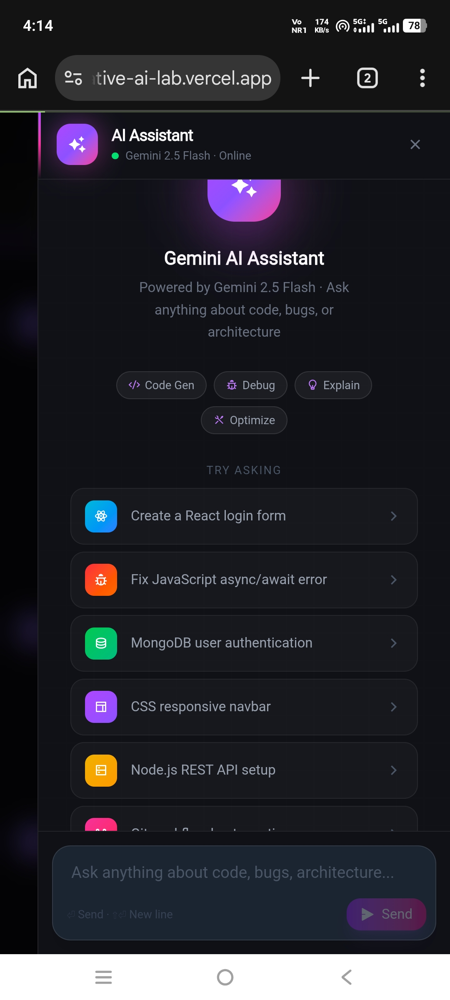
</p>
<p align="center"><i>Futuristic hero landing page with live demo access and platform overview</i></p>

---

## 🧠 What is Innovative AI?

**Innovative AI** is a premium, production-grade **AI-powered full-stack development platform** built for modern developers and teams. It unifies everything a developer needs into one intelligent workspace — from real-time collaboration and AI-assisted coding to an integrated terminal and smart file management.

| Capability | Description |
|---|---|
| 💬 **Real-Time Team Chat** | Instant WebSocket-powered collaboration with zero latency |
| 🤖 **AI Assistant** | Gemini-powered code generation, analysis & debugging |
| 💻 **Code Editor** | Write & execute code directly in the browser |
| 📂 **File Manager** | Upload, organize, and manage project files securely |
| 🖥️ **Live Terminal** | Run commands inside your project workspace |
| 🔔 **Notifications** | Real-time activity streams & smart alerts |

---

## 🔐 Authentication

<p align="center">
  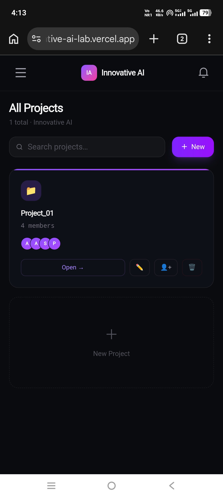
  &nbsp;&nbsp;
  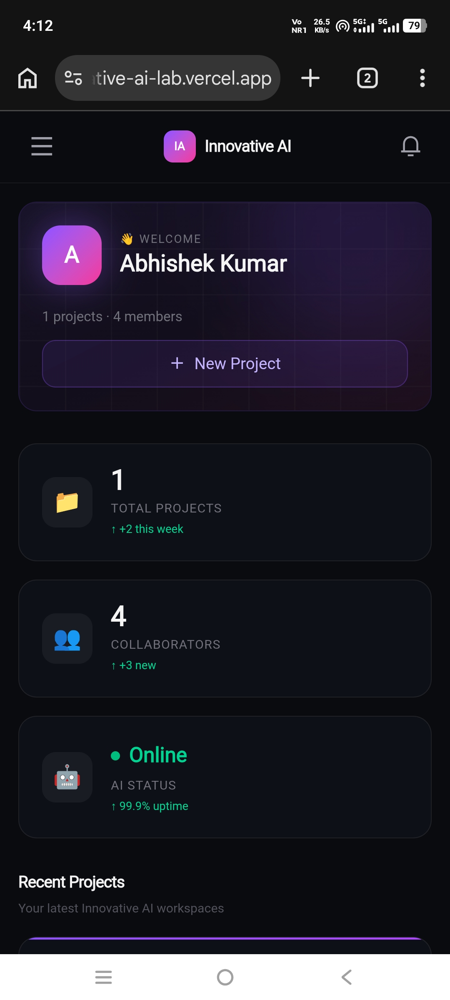
</p>
<p align="center"><i>Secure JWT-based Login & Registration — stateless, fast, and production-hardened</i></p>

---

## 📊 Project Dashboard

<p align="center">
  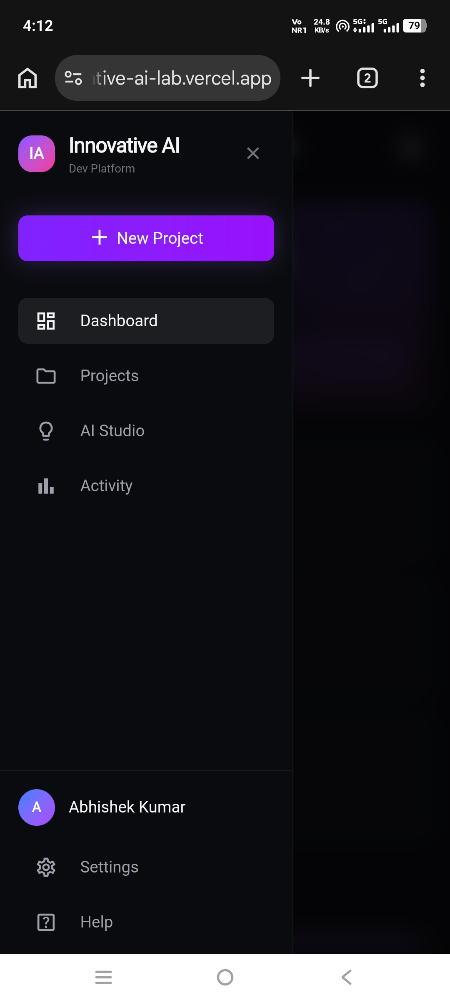
</p>
<p align="center"><i>Central dashboard — create, manage, and join project workspaces in one view</i></p>

---

## 💬 Real-Time Team Collaboration

<p align="center">
  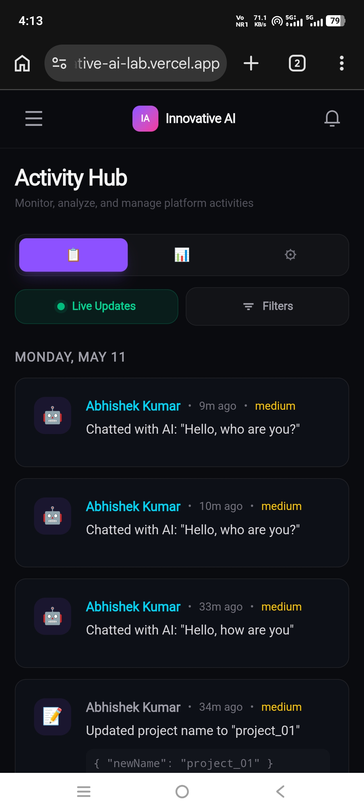
</p>
<p align="center"><i>Live team chat powered by Socket.io — instant messaging with real-time presence</i></p>

---

## 🤖 AI Studio — Gemini Powered

<p align="center">
  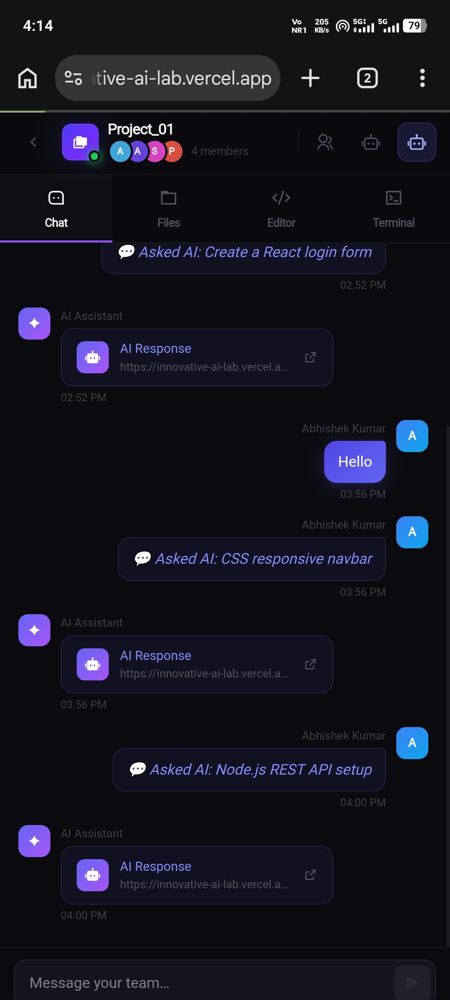
</p>
<p align="center"><i>Context-aware AI conversations using Gemini Flash — generate, refactor, and debug code instantly</i></p>

---

## 💻 Integrated Code Editor

<p align="center">
  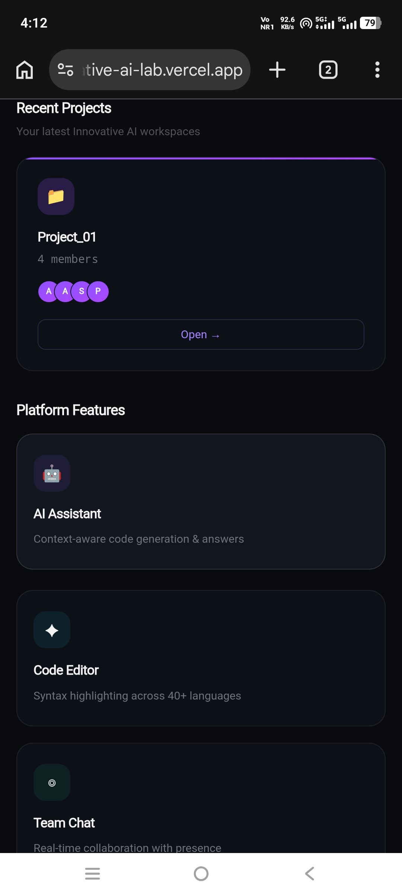
</p>
<p align="center"><i>Built-in browser code editor — write, edit, and execute without leaving the platform</i></p>

---

## 📂 Smart File Manager

<p align="center">
  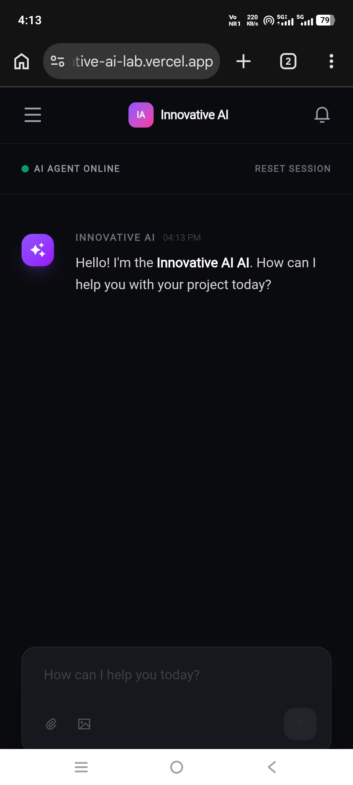
</p>
<p align="center"><i>Smart file manager — upload, organize, and manage all project assets securely</i></p>

---

## 🖥️ Live Terminal & Project Workspace

<p align="center">
  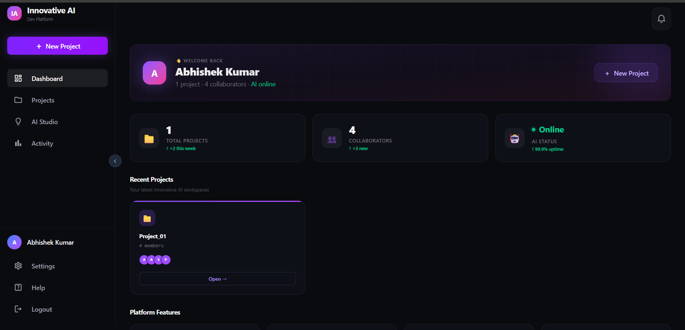
  &nbsp;&nbsp;
  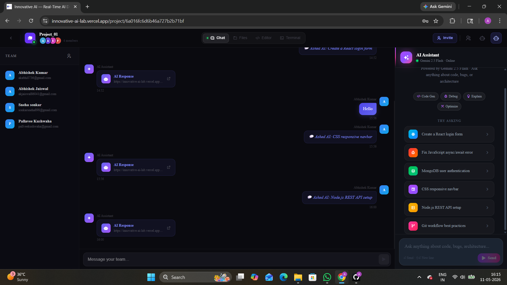
</p>
<p align="center"><i>Integrated terminal & full project workspace — run commands and manage everything in one place</i></p>

---

## 🔔 Notifications & Activity Feed

<p align="center">
  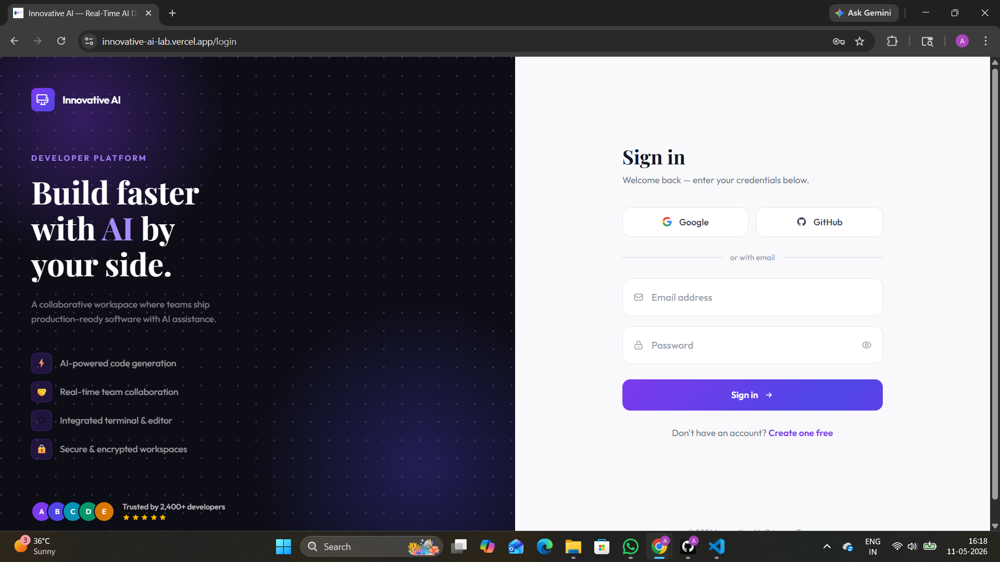
</p>
<p align="center"><i>Real-time notifications and live activity streams — stay updated on every project event</i></p>

---

## 🔥 Core Features

### ⚡ Developer Experience
- 🧠 **AI Coding Assistant** — Generate, refactor, and debug code instantly with Gemini Flash
- 💻 **Built-in Code Editor** — Write and execute code without leaving the browser
- 📂 **Smart File Manager** — Upload, organize, and manage project files securely
- 🖥️ **Integrated Terminal** — Run commands directly within your project workspace

### 💬 Real-Time Collaboration
- ⚡ **Instant Messaging** — WebSocket-powered team chat with zero latency
- 👥 **Team Workspaces** — Add members, assign roles, and collaborate live
- 🔄 **Live Activity Feed** — Real-time notifications and project activity streams

### 🤖 AI Capabilities
- **AI Studio** — Context-aware conversations using Gemini Flash models
- **Project Analysis** — Deep technical analysis and optimization suggestions
- **Code Generation** — Auto-generate boilerplates, scripts, and algorithms
- **Fail-Safe Architecture** — Robust fallback mechanisms for 99.9% AI uptime

---

## 🧠 Tech Stack

### 🛠️ Backend
| Technology | Purpose |
|---|---|
| **Node.js + Express.js** | High-performance RESTful API server |
| **MongoDB Atlas** | Scalable NoSQL cloud database |
| **Mongoose** | Elegant MongoDB object modeling |
| **Socket.io** | Real-time bidirectional communication |
| **JWT + bcrypt** | Secure authentication & password hashing |
| **Google Gemini API** | AI model integration |
| **Helmet + Rate Limiter** | API security hardening |

### 🎨 Frontend
| Technology | Purpose |
|---|---|
| **React + Vite** | Blazing fast modern frontend |
| **Tailwind CSS** | Utility-first dark-themed UI |
| **Framer Motion** | Smooth micro-animations |
| **Axios** | Interceptor-based HTTP client |
| **React Router** | Client-side routing |
| **Socket.io Client** | Real-time frontend events |

---

## 🏗️ Architecture Overview

```
┌─────────────────────────────────────────────────────────┐
│                     CLIENT (React + Vite)                │
│         Tailwind UI  ·  Framer Motion  ·  Axios          │
└──────────────────────────┬──────────────────────────────┘
                           │ HTTP / WebSocket
┌──────────────────────────▼──────────────────────────────┐
│                  SERVER (Node.js + Express)               │
│    REST API  ·  Socket.io  ·  JWT Auth  ·  Middleware     │
└────────┬──────────────────────────────────┬─────────────┘
         │                                  │
┌────────▼────────┐               ┌─────────▼──────────┐
│  MongoDB Atlas  │               │   Google Gemini AI  │
│  (Cloud DB)     │               │   (Flash Models)    │
└─────────────────┘               └────────────────────┘
```

---

## 🌐 Live Deployment

| Service | URL | Platform |
|---|---|---|
| 🚀 **Frontend** | [innovative-ai.vercel.app](https://innovative-ai.vercel.app) | Vercel |
| ⚙️ **Backend API** | [innovative-ai-backend-kuq3.onrender.com](https://innovative-ai-backend-kuq3.onrender.com) | Render |
| 📦 **Repository** | [github.com/Innovative-AI-Lab/Innovative-AI-](https://github.com/Innovative-AI-Lab/Innovative-AI-) | GitHub |

---

## ⚙️ Local Installation

```bash
git clone https://github.com/Innovative-AI-Lab/Innovative-AI-
cd Innovative-AI-
```

### 📦 Backend
```bash
cd Backend
npm install
npm run dev
```

### 🎨 Frontend
```bash
cd Frontend
npm install
npm run dev
```

### 🔐 Environment Variables

Create `.env` files based on the provided `.env.example` files.

**Backend `.env`**
```env
PORT=4001
MONGODB_URI=<your_mongodb_uri>
JWT_SECRET=<your_jwt_secret>
GEMINI_API_KEY=<your_gemini_api_key>
FRONTEND_URL=http://localhost:5173
```

**Frontend `.env`**
```env
VITE_API_URL=http://localhost:4001
```

> ⚠️ Never commit `.env` files. They are protected by `.gitignore`.

### 🌐 Access Locally

| Service | URL |
|---|---|
| Frontend | `http://localhost:5173` |
| Backend | `http://localhost:4001` |

---

## 🧪 How to Use

1. **Register / Login** — Securely authenticate into the platform
2. **Create a Project** — Set up a new workspace or join an existing one
3. **Open Workspace** — Dive into the full IDE interface
4. **Chat with Team + AI** — Collaborate live and summon AI for insights
5. **Edit Code & Manage Files** — Use the editor and file manager to build
6. **Run Terminal Commands** — Execute scripts directly in your workspace

---

## 🔒 Security

| Layer | Implementation |
|---|---|
| **Authentication** | Stateless JWT tokens with expiry |
| **Password Security** | bcrypt hashing (industry standard) |
| **API Hardening** | Helmet, CORS, Rate Limiting |
| **Token Blacklisting** | Invalidated tokens stored securely |
| **Error Handling** | Sanitized responses — no internals exposed |
| **Environment Safety** | Strict `.env` validation, never committed |

---

## 🚀 Deployment Guide

### Frontend → Vercel
```bash
cd Frontend
npm run build
# Deploy dist/ to Vercel
```

### Backend → Render
```bash
cd Backend
# Set environment variables in Render dashboard
# Deploy as Node.js service
```

---

## 🗺️ Future Roadmap

- [ ] 🧠 Multi-model AI support (GPT-4, Claude, Llama)
- [ ] 🎙️ Voice-to-code AI assistant
- [ ] 🌍 Multi-language code execution (Python, Go, Rust)
- [ ] 📊 Project analytics & usage dashboard
- [ ] 🔌 VS Code extension integration
- [ ] 🤝 Pair programming with live cursor sharing
- [ ] 📱 Mobile-responsive workspace
- [ ] 🏢 Team organization & billing management

---

## 🤝 Contributing

```bash
# Fork the repository, then:
git checkout -b feature/your-feature
git commit -m "feat: your feature description"
git push origin feature/your-feature
# Open a Pull Request
```

> Never commit `.env` files or secrets. Follow clean commit conventions.

---

## 👨💻 About the Developer

<div align="center">

### Abhishek Kumar

**Full Stack Developer · AI SaaS Builder · MERN Stack Engineer**

Building next-generation AI-powered SaaS products that push the boundaries of what's possible on the web.

<br/>

[](https://abhishek-web.vercel.app/)
[](https://github.com/Innovative-AI-Lab)

</div>

---

## ⭐ Support the Project

- ⭐ **Star** the repository
- 🚀 **Share** with other developers
- 🤝 **Contribute** to make it better
- 🐛 **Report issues** to help improve quality

---

<div align="center">

**Innovative AI** — *Where Human Creativity Meets Artificial Intelligence*

<br/>

[](https://innovative-ai.vercel.app)

<br/>

<sub>💀 Built with passion + caffeine + AI by <strong>Abhishek Kumar</strong></sub>

</div>
